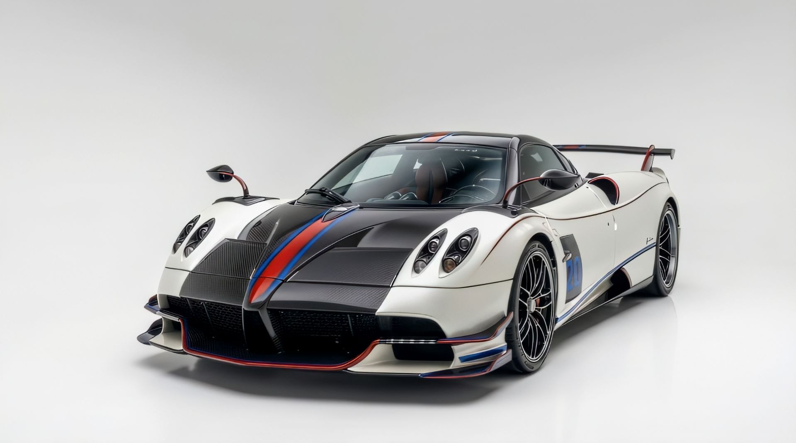
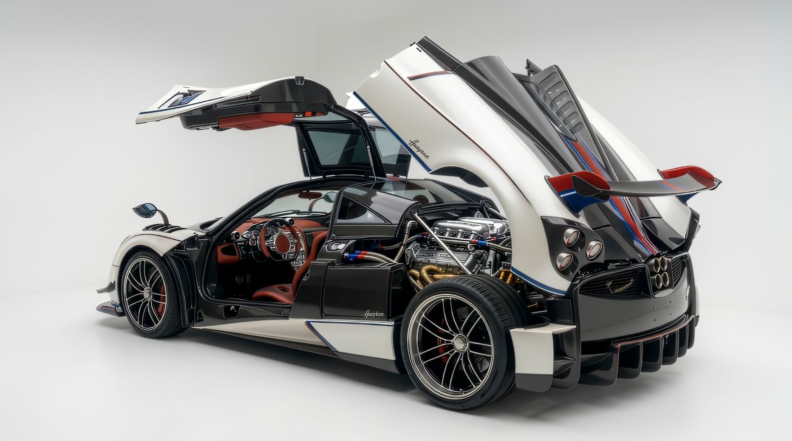
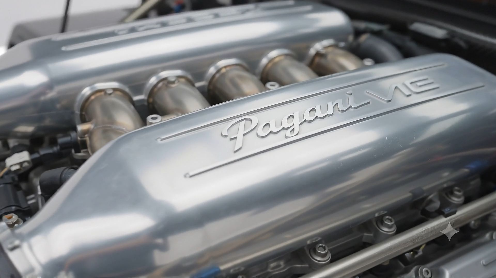
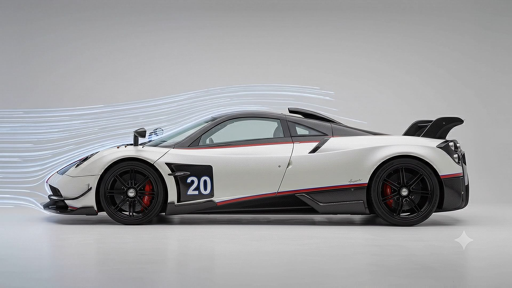
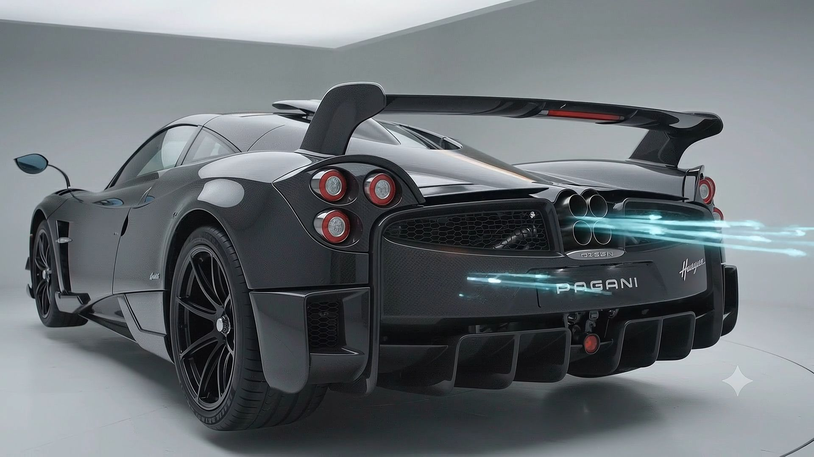

# Pagani Huayra BC | Macchina Volante



An ultra-premium, Awwwards-style single-page digital experience showcasing the Pagani Huayra BC. This project is built to deliver a highly cinematic, scroll-driven storytelling experience that combines luxury design aesthetics with high-performance web engineering.

## 🌟 Key Features

<div align="center">
  
  
</div>

- **Cinematic Scroll Sequences**: Frame-by-frame 4K image sequences tied perfectly to the user's scroll position, creating a seamless "video-like" interactive experience.
- **High-DPI Canvas Rendering**: Ensures absolute pixel-perfection on Retina displays without performance drops.
- **Interactive Wind Tunnel**: A hold-to-interact aerodynamics visualization that scrubs through real-time frame sequences and calculates simulated downforce.
- **Exploded Architecture**: Anti-gravity engineering exhibitions that deconstruct the M158 V12 Biturbo engine and the active aerodynamic flap system.

<div align="center">
  
  
</div>

- **Luxury UI/UX**: Features a custom magnetic Pagani-red cursor, SVG line-drawing pre-loaders, and typography tailored for a high-end automotive atelier.
- **Smooth Scrolling**: Implemented via Lenis for a buttery-smooth, momentum-based scrolling experience.

## 🛠️ Technology Stack

- **Framework**: [Next.js 14](https://nextjs.org/) (App Router)
- **Language**: [TypeScript](https://www.typescriptlang.org/)
- **Styling**: [Tailwind CSS v4](https://tailwindcss.com/)
- **Animation**: [Framer Motion](https://www.framer.com/motion/)
- **Scroll Physics**: [Lenis](https://lenis.studiofreight.com/)
- **Core Logic**: HTML5 `<canvas>` + `requestAnimationFrame`

## 🚀 Getting Started

### Prerequisites
Make sure you have [Node.js](https://nodejs.org/) installed on your machine.

### Installation

1. Clone the repository:
   ```bash
   git clone https://github.com/YOUR_USERNAME/Pagani-Car-Website.git
   ```
2. Navigate into the directory:
   ```bash
   cd Pagani-Car-Website
   ```
3. Install the dependencies:
   ```bash
   npm install
   ```

### Running Locally

Start the development server:
```bash
npm run dev
```
Open [http://localhost:3000](http://localhost:3000) in your browser to experience the showcase.

## 🎨 Design System
- **Colors**: Pure White, Pagani Red (`#CC0000`), Near Black (`#111111`), Mid Gray.
- **Typography**: 
  - *Orbitron*: Used for aggressive, hyper-modern headings and UI elements.
  - *Rajdhani*: Used for legible, technical body copy and subtitles.

---
*Built with precision and passion.*
